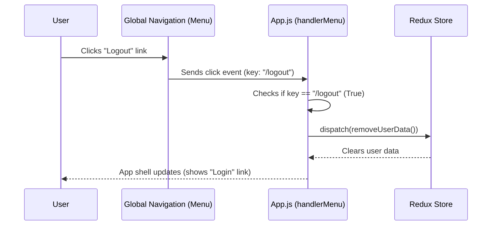

### [👈 Overview](index.md)

# Chapter 1: App Shell & Global Navigation

Welcome to the first chapter! We are starting our journey by looking at the foundation of our entire application: the **App Shell**.

Think of the App Shell like the physical case of a mobile phone. It provides the consistent, recognizable structure—the screen bezel, the buttons, and the overall frame—no matter which application you open on the phone. Our web application needs a similar consistent wrapper.

## What is the App Shell?

The App Shell is the top-level visual container that wraps everything else. It ensures that regardless of which page the user visits (e.g., the Login page, the Dashboard, or a User List), they always see the same main elements:

1.  A **Global Header** (where the navigation lives).
2.  A large, flexible **Content Area** (where the specific page content loads).
3.  A universal **Footer**.

In our project, this App Shell is defined primarily within the `src/App.js` component.

## Deconstructing `App.js`

The `App.js` file is the entry point for the visual structure. Let’s look at the three main parts of the shell defined here:

### 1. The Layout Structure

We use the Ant Design `Layout` component to easily define our main sections: `Header`, `Content`, and `Footer`. This immediately establishes the overall vertical flow of the page.

```javascript
// src/App.js (Simplified Structure)
import { Layout } from "antd";

const { Header, Footer, Content } = Layout;

export default function App() {
	return (
		<Layout style={{minHeight: "100vh"}}>
			<Header>
				{/* Navigation Menu goes here */}
			</Header>
			
			<Content>
				{/* Dynamic Page Content loads here */}
			</Content>

			<Footer>
				Test Dashboard ©{new Date().getFullYear()}...
			</Footer>
		</Layout>
	);
}
```

This code snippet guarantees that our application always has a header fixed at the top and a footer at the bottom, creating a professional, predictable layout.

### 2. Global Navigation and Dynamic Content

#### The `Outlet`: The Content Hole

Since the `App.js` component wraps *all* other pages, we need a special placeholder to tell React where to render the specific page content (like the Login form or the Dashboard widgets). This placeholder is the `Outlet` component, provided by React Router.

| Component | Purpose | Analogy |
| :--- | :--- | :--- |
| **`Header` & `Footer`** | Static parts of the structure that never change. | The fixed border of a picture frame. |
| **`Outlet`** | The dynamic area where content changes based on the URL. | The space inside the picture frame where the photo sits. |

In the code, the `Outlet` sits right inside the `Content` area:

```javascript
// src/App.js (Content Area)
import { Outlet } from "react-router"; 
// ...
<Content style={{ /* styling */ }}>
    <Outlet /> 
</Content>
```
When you navigate to `/dashboard`, the Dashboard component loads inside this `Outlet`. When you go to `/login`, the Login component loads there instead.

#### The Navigation Links

Our global navigation is located in the `Header`. This menu provides persistent links to key parts of the application, most importantly: **Dashboard** and the **Authentication Link** (Login/Logout).

```javascript
// src/App.js (Simplified Header Menu)
import { Menu } from "antd";
import { Link } from "react-router";
// ...
<Header>
    <Menu
        theme="dark"
        mode="horizontal"
        items={[
            {
                label: <Link to="/login">Login/Logout</Link>,
                key: "/auth_status",
            },
            {
                label: <Link to="/dashboard">Dashboard</Link>,
                key: "/dashboard",
            },
        ]}
    />
</Header>
```
The `Link` component ensures that clicking on "Dashboard" changes the URL to `/dashboard`, which then triggers the correct component to render in the `Outlet`. We will explore how these URLs map to components in the next chapter: [Router Structure & Access Control](02_router_structure.md).

## Handling Global Actions: Logout

One crucial job of the App Shell's navigation is handling global actions like logging out the user, regardless of which page they are currently viewing.

The login/logout button dynamically changes its text based on whether a user is currently logged in (`user` data exists in our application state). We check this state using a special React tool called `useSelector`, which reads data from our central state manager (Redux). This state management process is detailed further in [Authentication State Management & Login Hook](03_authentication_state.md).

### The Logout Process

When the user is logged in, the menu item text changes to `Logout [User Name]`. When clicked, it must clear the user's session data.

We attach a function called `handlerMenu` to the entire navigation menu to catch any clicks:

```javascript
// src/App.js (Logout Handler Snippet)
import { useDispatch } from "react-redux";
import { removeUserData } from "./store/slices/authUserSlice"; 
// ...
const dispatch = useDispatch();

function handlerMenu({ key }) {
    // 1. Check if the clicked item's 'key' is '/logout'
	if (key === "/logout") {
        // 2. If it is, dispatch the Redux action
		dispatch(removeUserData());
	}
}

// ... Menu definition (where we attach the handler)
<Menu
    // ... items definitions
    onClick={handlerMenu} // <--- This runs our function on click
/>
```

When a user clicks "Logout," this is what happens behind the scenes:



By dispatching `removeUserData()`, we clear the user session information from the application's memory. Because the App Shell is constantly checking this state (`useSelector`), the "Logout" link immediately flips back to "Login," confirming the action was successful.

## Conclusion

The App Shell, defined in `App.js`, is the essential, consistent wrapper for our application. It provides fixed elements (Header/Footer), handles global navigation, and manages top-level actions like Logout using the Redux state manager. The `Outlet` ensures that specific page content can be rendered dynamically within this static frame.

Next, we will explore the rules that govern which components load inside that `Outlet` and how we control access to secure pages using the Router configuration.  
<br />
**References**: [[1]](../src/App.js "App")

---

#### [👈 Overview of dashboard](index.md)&nbsp; | &nbsp;[Next Chapter: Router Structure & Access Control 👉](02_router_structure.md)