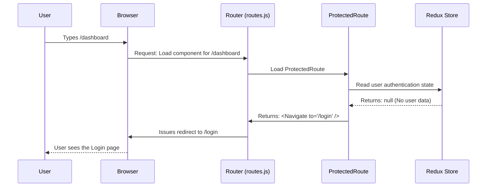

### [👈 Overview](index.md)

# Chapter 2: Router Structure & Access Control

In the previous chapter, [App Shell & Global Navigation](01_app_shell.md), we established the main structural frame of our application—the `App` shell and its content placeholder, the `Outlet`.

Now we must define the rules:

1.  Which specific pages (components) should load into that `Outlet` based on the URL? (The Directory).
2.  How do we ensure that unauthorized users cannot see sensitive pages like the Dashboard? (The Security Desk).

This chapter focuses on the **Router Structure** (using React Router) and **Access Control** (using Route Guards) to solve these problems.

## The Building Directory: Defining Routes

The router acts as the building's directory, mapping street addresses (URLs) to specific rooms (components). Our application’s directory is defined in `src/router/routes.js`.

We use a function called `createBrowserRouter` to set up the mapping rules:

```javascript
// src/router/routes.js (Simplified Structure)
import { createBrowserRouter } from "react-router";
import App from "../App";
import ProtectedRoute from "./ProtectedRoute";
import PublicRoute from "./PublicRoute";

const router = createBrowserRouter([
	{
		path: "/", // Base URL (e.g., dashboard.com)
		Component: App, // The component defined in Chapter 1
		children: [
			{ path: "dashboard", Component: ProtectedRoute },
			{ path: "login", Component: PublicRoute },
		],
	},
]);

export default router;
```

In this structure:
1.  **`/` (Base Path):** This loads the `App` component, which provides the header and footer (the App Shell).
2.  **`dashboard`:** If the URL is `/dashboard`, it attempts to load the `ProtectedRoute` component.
3.  **`login`:** If the URL is `/login`, it loads the `PublicRoute` component.

Notice that we aren't loading the `Dashboard` or `Login` component directly. We load special wrapper components: the **Route Guards**.

## The Security Desk: Route Guards

Route Guards are the components that handle access control. They check the user’s current status (are they logged in? We read this from our central data store, Redux) and decide whether to let them through or redirect them somewhere else.

We use two primary types of guards:

| Guard Name | Purpose | Rule Check | Default Action |
| :--- | :--- | :--- | :--- |
| **`ProtectedRoute`** | Securing private areas (e.g., Dashboard). | **Must** be logged in. | If unauthorized, redirects to `/login`. |
| **`PublicRoute`** | Guarding public areas (e.g., Login/Sign Up). | **Must not** be logged in. | If already logged in, redirects to `/dashboard`. |

Both guards rely on checking the `user` state saved in Redux. We use the `useSelector` hook for this check.

## Deconstructing the `ProtectedRoute`

The `ProtectedRoute` is like a VIP entrance. If you don't have the badge (the `user` data), you cannot enter.

If the user data exists, the guard lets the actual content (`<Dashboard />`) render. If it doesn't exist, it uses the special React Router component `<Navigate to="/login" />` to immediately redirect the browser.

```javascript
// src/router/ProtectedRoute.jsx (The VIP Entrance)
import { Navigate } from "react-router";
import { useSelector } from "react-redux";
import Dashboard from "../components/Dashboard/Dashboard";

export default function ProtectedRoute(){
    // 1. Check Redux state for user data
    const user = useSelector(state => state.authUser.userData);

    // 2. Decide what to render
    return user 
        ? <Dashboard /> 
        : <Navigate to="/login" />; 
}
```

## Deconstructing the `PublicRoute`

The `PublicRoute` is used for pages that should only be seen by logged-out users, primarily the login screen. Once a user logs in, seeing the login screen again is unnecessary.

If the user data exists (meaning they are logged in), the guard immediately redirects them to the `/dashboard`.

```javascript
// src/router/PublicRoute.jsx (The Anti-Bouncer)
import { Navigate } from "react-router";
import { useSelector } from "react-redux";
import Login from "../components/Login/Login";

export default function ProtectedRoute(){
    // 1. Check Redux state for user data
    const user = useSelector(state => state.authUser.userData);

    // 2. Decide what to render
    // If NOT logged in, show Login.
    return !user 
        ? <Login /> 
        : <Navigate to="/dashboard" />;
}
```

## Access Control Flow

Let’s visualize what happens when a logged-out user tries to access the secure dashboard page (`/dashboard`).



The Guard intercepts the request and handles the redirection before the sensitive component (`Dashboard`) ever gets a chance to render.

## Nested Routes: Deeper Navigation

Our Dashboard is complex and contains its own sub-pages, like the profile or a list of users. The Router handles this by allowing **Nested Routes**.

When the router loads `ProtectedRoute` for `/dashboard`, it treats `ProtectedRoute` as the new parent wrapper. Any child routes defined underneath it will load inside the `Outlet` *within* the `ProtectedRoute` component (or the `Dashboard` component it renders).

In `routes.js`, the structure looks like this:

```javascript
// src/router/routes.js (Nested Dashboard Routes)
// ...
{
    path: "dashboard",
    Component: ProtectedRoute, // <--- This loads first, checks auth
    children: [
        {
            index: true,
            // Default: If they just go to /dashboard, send them to /dashboard/profile
            element: <Navigate to="profile" replace />, 
        },
        {
            path: "profile", // URL: /dashboard/profile
            Component: Profile,
        },
        {
            path: "users", // URL: /dashboard/users
            Component: UsersList,
        },
    ],
},
// ...
```

This nested structure means that the `Profile` and `UsersList` components are also secured automatically, as they can only be reached if the main `ProtectedRoute` allows access to the parent `/dashboard` path first.

## Conclusion

The Router structure defined in `routes.js` provides the map for our application. Crucially, we use specialized **Route Guards** (`ProtectedRoute` and `PublicRoute`) to enforce access rules. These guards check the user's status in the Redux store and either allow access to the intended page or force a redirection, securing our application effortlessly.

But how does the user data get into the Redux store in the first place? In the next chapter, we will explore the core concepts of managing the logged-in state and implementing the login mechanism.  
<br />
**References**: [[1]](../src/App.js "App"), [[2]](../src/router/ProtectedRoute.jsx "ProtectedRoute"), [[3]](../src/router/PublicRoute.jsx "PublicRoute"), [[4]](../src/router/routes.js "router")

---

[👈 Previous Chapter: App Shell & Global Navigation](01_app_shell.md)&nbsp; | &nbsp;[Next Chapter: Authentication State Management & Login Hook 👉](03_authentication_state.md)