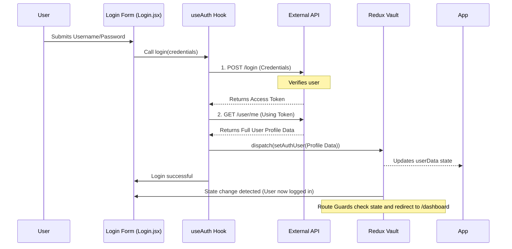

### [⬅ Overview](index.md)

# Chapter 3: Authentication State Management & Login Hook

In the previous chapter, [Router Structure & Access Control](02_router_structure.md), we learned that our Route Guards check the application’s state to see if a user is logged in before allowing access to secure pages.

But how does the application know the user’s identity in the first place? How does that identity information—the user’s name, email, and ID—get stored safely and reliably?

This chapter focuses on the complete process of logging a user in: using a dedicated **Vault** (Redux Slice) to store the data and a specialized **Worker Hook** (`useAuth`) to handle the complex communication with the external API.

## 1. The Central Vault: `authUserSlice`

We need one single, reliable place to store the current user's profile information. In our system, this central place is called the `authUserSlice`—our dedicated Redux store "vault" for authentication data.

### Defining the Vault

The vault is initialized to hold nothing (`userData: null`). When the user successfully logs in, this state is updated to hold their entire profile object.

```javascript
// src/store/slices/authUserSlice.js (The Vault Definition)
import { createSlice } from "@reduxjs/toolkit";

const authUserSlice = createSlice({
	name: "authUser",
	initialState: {
		userData: null, // Starts empty
	},
	reducers: {
        setAuthUser(state, action) {
            // Action to save user data after successful login
            state.userData = action.payload;
        },
        removeUserData(state) {
            // Action used for logout (Chapter 1)
            state.userData = null;
        }
    },
});

export const { setAuthUser, removeUserData } = authUserSlice.actions;
export default authUserSlice.reducer;
```

**Key Takeaway:** The entire application relies on reading the `userData` field from this slice. If it contains data, the user is logged in; if it is `null`, they are logged out.

## 2. The Worker Hook: `useAuth`

Logging in is never just one step. It usually involves sending credentials, getting a security token back, and then using that token to ask the API for the user’s detailed profile. This is complicated logic.

To keep our login component clean, we wrap all this complexity into a single, reusable custom hook called `useAuth`. Think of this hook as a dedicated worker that knows exactly how to talk to the API and manage the temporary security token.

### Using the Worker in the Login Form

When the user enters their credentials and clicks "Login," the `Login.jsx` component uses the `useAuth` worker.

```javascript
// src/components/Login/Login.jsx (Simplified)
import useAuth from "../../hooks/useAuth"; 

export default function Login() {
	// 1. Get the login function from the worker hook
	const login = useAuth(); 

	const onFinish = async (userData) => {
		try {
            // 2. Pass the credentials to the worker
			await login(userData); 
		} 
		catch (error) {
			// Handle errors
		} 
	};
    
    // ... form rendering ...
	// <Form onFinish={onFinish}> ... </Form>
}
```

The component doesn't care *how* the login happens; it just trusts the `login` function returned by `useAuth` to handle everything.

## 3. The Full Login Lifecycle

When `useAuth().login(credentials)` is called, the hook performs a two-step handshake with the server to authenticate the user and retrieve their profile data before saving it into the Redux Vault.

### Step-by-Step Flow

This diagram illustrates the full journey from submitting the form to updating the application state:



### Deconstructing the `useAuth` Worker

The hook coordinates the API calls and the dispatch actions. It uses two main mechanisms:

#### A. Initial Login (POST Request)

The `login` function handles the initial POST request to the API. If successful, the API returns a temporary `accessToken`. We store this token internally in the hook's local state.

```javascript
// src/hooks/useAuth.js (Login Function)
import axios from "axios";
// ...
export default function useAuth() {
    // ... const [token, setToken] = useState(null);

    async function login(authData) {
        // Send credentials to get the token
        const response = await axios.post(
            "https://dummyjson.com/user/login",
            authData,
            // ... headers ...
        );
        // Save the token internally, which triggers the next step
        setToken(response?.data.accessToken); 
    }

    return login;
}
```

#### B. Profile Fetch and State Update (GET Request)

Once the `token` is set (which means the login step was successful), a special React function (`useEffect`) runs immediately. This function uses the new token to fetch the detailed profile and save it to Redux.

```javascript
// src/hooks/useAuth.js (Profile Fetch)
import { useEffect, useState } from "react";
import { useDispatch } from "react-redux";
import { setAuthUser } from "../store/slices/authUserSlice";
// ...

export default function useAuth() {
    const [token, setToken] = useState(null);
	const dispatch = useDispatch();

	useEffect(() => {
		if (!token) return; // Skip if no token is available

		axios
			.get("https://dummyjson.com/user/me", {
				headers: { Authorization: `Bearer ${token}` },
			})
			.then((response) => {
                // Save the fetched data to our Redux Vault
				dispatch(setAuthUser(response.data)); 
			})
			.catch((error) => console.error("Auth failed:", error.message));
	}, [token]); // This runs whenever the 'token' changes

    // ... returns login function
}
```

This sequence ensures that the user is only considered logged in *after* we have successfully retrieved and saved their full profile data into the Redux Vault (`authUserSlice`). Once the Redux state is updated, the **Route Guards** we discussed in [Router Structure & Access Control](02_router_structure.md) instantly detect the change and redirect the user from `/login` to `/dashboard`.

## Conclusion

Authentication State Management is achieved by centralizing the user's identity in the `authUserSlice` (the Vault). The entire login process is abstracted away into the `useAuth` hook (the Worker), which handles the complex, multi-step communication required to exchange credentials for a secure, validated user profile. This clear separation of concerns ensures that the identity of the user is consistent and reliable across the entire application, whether we are checking access control or displaying their name in the navigation bar.

Now that we understand how user authentication works, we can dive into the secure areas of the application and explore how the dashboard itself is structured.  
<br />
**References**: [[1]](../src/components/Login/Login.jsx "Login"), [[2]](../src/components/Profile/Profile.jsx "Profile"), [[3]](../src/hooks/useAuth.js "useAuth"), [[4]](../src/store/slices/authUserSlice.js "authUserSlice")

---

<table width="100%">
<tr>
<td align="left">

[⬅ Previous Chapter: Router Structure & Access Control](02_router_structure.md)

</td>
<td align="right">

[Next Chapter: Dashboard Modular Layout ➡](04_dashboard.md)

</td>
</tr>
</table>