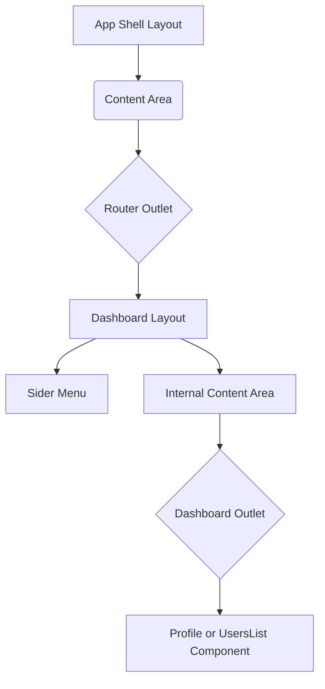
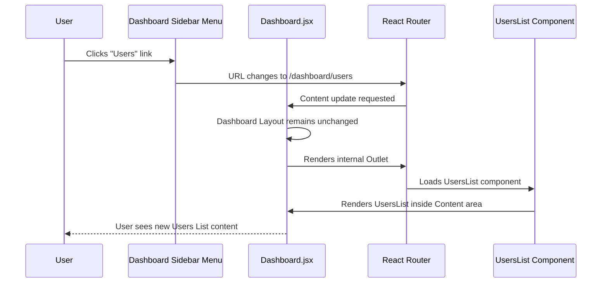

### [👈 Overview](index.md)

# Chapter 4: Dashboard Modular Layout

In the previous chapters, we set up the [App Shell & Global Navigation](01_app_shell.md) and implemented the security measures using [Router Structure & Access Control](02_router_structure.md) and [Authentication State Management & Login Hook](03_authentication_state.md).

Now, successfully logged-in users are redirected to `/dashboard`. But what should they see?

The Dashboard is the central, secure workspace, and it needs a structure different from the main application shell. It requires internal navigation (a side menu) and needs to adapt perfectly to any device, from a large monitor to a small mobile phone.

This chapter introduces the **Dashboard Modular Layout**, the dedicated component (`Dashboard.jsx`) that manages the look, feel, and responsiveness of the authenticated workspace.

## The Problem: Internal Structure

When you enter the secure area, you typically need sub-pages, like "Profile Settings" or "User Management."

If we try to use the main `App` shell structure, we run into two issues:

1.  **Too Simple:** The `App` shell only has a Header and a Content area. We need a persistent **Sidebar** for quick internal navigation.
2.  **Responsiveness:** We need the sidebar to automatically collapse or move to the top when the user views the dashboard on a small screen (like a phone).

The `Dashboard.jsx` component solves this by creating a dedicated, responsive structure using Ant Design's `Layout` components.

## 1. Defining the Structure: Sidebar and Content

Our internal dashboard layout consists of two main pieces defined within `Dashboard.jsx`:

| Component | Role | Analogy |
| :--- | :--- | :--- |
| **`Sider`** | The persistent, vertical sidebar menu. | The directory on the left wall of an office suite. |
| **`Content`** | The main area where sub-pages (Profile, Users) load. | The flexible room where the actual work happens. |

Because we are using Ant Design's `Layout`, we simply wrap the `Sider` and `Content` components inside the main `Layout` wrapper.

```javascript
// src/components/Dashboard/Dashboard.jsx (Structure)
import { Layout, Menu } from "antd";
import { Outlet } from "react-router";
// ...
const { Content, Sider } = Layout;

export default function Dashboard() {
    // ... styling and logic omitted ...
	return (
		<Layout style={{ /* container styles */ }}>
            {/* 1. The Sidebar */}
			<Sider style={{ /* style */ }} width={200}>
				<Menu items={[ /* Profile & Users Links */ ]} />
			</Sider>
            
            {/* 2. The Main Content Area */}
			<Content style={{ /* style */ }}>
				<Outlet /> {/* <-- Sub-page content loads here */}
			</Content>
		</Layout>
	);
}
```

### The Nested `Outlet`

Just like the main application shell has an `Outlet` (from Chapter 1) where the Dashboard loads, the Dashboard component itself uses another `Outlet`.

Since we defined **Nested Routes** in our router for `/dashboard/profile` and `/dashboard/users` (Chapter 2), the specific components (like `Profile.jsx` or `UsersList.jsx`) will load directly inside this second, internal `Outlet`.

This is the hierarchy:



## 2. Implementing Dynamic Responsiveness

The critical feature of the Dashboard Layout is its ability to automatically change its appearance based on the device size. We achieve this using Ant Design's `Grid` helper, specifically the `useBreakpoint` hook.

### How `useBreakpoint` Works

The `useBreakpoint` hook tells us which size category the screen currently falls into (e.g., `sm` for small, `md` for medium, `lg` for large). We only care about whether the screen is medium size (`md`) or larger, which suggests a desktop or tablet view.

```javascript
// Inside Dashboard.jsx
import { Grid } from "antd";
const { useBreakpoint } = Grid;

export default function Dashboard() {
	const width = useBreakpoint(); // { xs: true, sm: true, md: false, ... }
    
    // Check if the screen is MD (Medium) or larger
    const isDesktop = width.md; 
    
    // If isDesktop is TRUE, we use the sidebar layout.
    // If isDesktop is FALSE, we stack the menus vertically.
    // ...
}
```

### Adapting the Layout (Sider vs. Menu)

We use the `isDesktop` check (`width.md`) to dynamically adjust three main areas:

| Area | Desktop View (`width.md` is True) | Mobile View (`width.md` is False) |
| :--- | :--- | :--- |
| **Sidebar Display** | `Layout hasSider={true}` (Sidebar is visible vertically) | `Layout hasSider={false}` (Sidebar hides, navigation moves up) |
| **Menu Mode** | Sidebar Menu uses `mode="inline"` (vertical stack) | Navigation Menu uses `mode="horizontal"` (top bar stack) |
| **Layout Direction** | Content and Sider side-by-side (`flexDirection: "row"`) | Content and Sider stacked (`flexDirection: "column"`) |

This responsive design ensures a great user experience on all devices without needing to write complex custom CSS media queries.

```javascript
// src/components/Dashboard/Dashboard.jsx (Responsiveness Check)
import { Layout, Menu, Grid } from "antd";
// ...
const { Content, Sider } = Layout;
const { useBreakpoint } = Grid;

export default function Dashboard() {
	const width = useBreakpoint(); 

	return (
		<Layout
			// 1. Enable Sider only if it's desktop (md or larger)
			hasSider={width.md ? true : false} 
			style={{
				// 2. Stack elements vertically on mobile, horizontally on desktop
				flexDirection: width.md ? "row" : "column", 
				width: width.md ? "auto" : "100%",
			}}
		>
			<Sider style={{ /* style */ }} width={width.md ? 200 : "100%"}>
				<Menu
					// 3. Set menu direction based on width
					mode={`${width.md ? "inline" : "horizontal"}`} 
					// ... links omitted ...
				/>
			</Sider>
			<Content>{/* Outlet */}</Content>
		</Layout>
	);
}
```

## Dashboard Navigation Flow

When a user clicks on a link in the sidebar, the `Dashboard.jsx` component stays in place, but its internal `Outlet` updates with the new content.

Let's trace the journey from the Profile page to the Users List page:



The user never leaves the secure `/dashboard` parent route, which keeps the security protection (from the [Protected Route](02_router_structure.md) guard) constantly active.

## Conclusion

The **Dashboard Modular Layout** (`Dashboard.jsx`) provides the critical structural template for the secure area of our application. By using Ant Design's `Layout` components and the `useBreakpoint` hook, it seamlessly defines a persistent sidebar for navigation and ensures that this complex structure automatically adapts for optimal viewing on both desktop and mobile devices.

Within this consistent layout, our next task is to fetch and display dynamic, external data, like the actual list of users.  
<br />
**References**: [[1]](../src/components/Dashboard/Dashboard.jsx "Dashboard"), [[2]](../src/components/Profile/Profile.jsx "Profile"), [[3]](../src/components/UsersList/UsersList.jsx "UsersList")

---

#### [👈 Previous Chapter: Authentication State Management & Login Hook](03_authentication_state.md)&nbsp; | &nbsp;[Next Chapter: External Data Fetching Pattern (Users List) 👉](05_external_data.md)