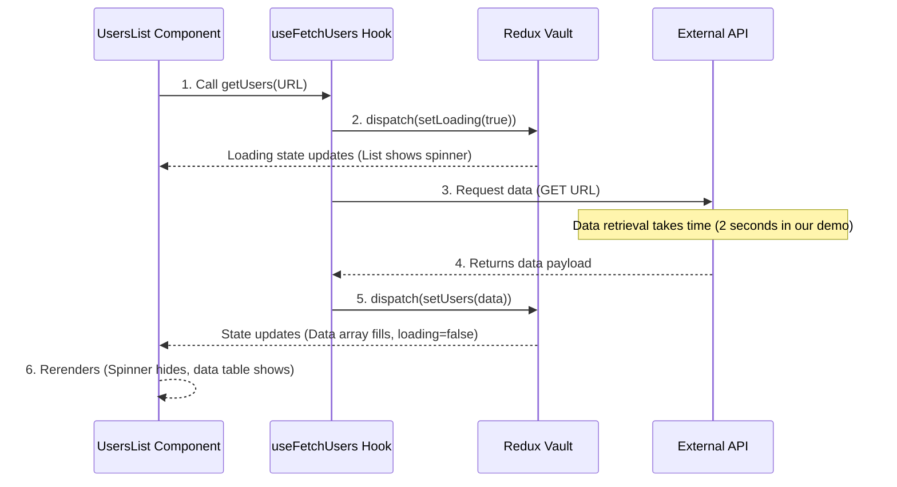

### [👈 Overview](index.md)

# Chapter 5: External Data Fetching Pattern (Users List)

In the previous chapter, [Dashboard Modular Layout](04_dashboard.md), we established the secure, responsive layout for our authenticated users. Now, we are ready to fill that layout with dynamic content, starting with a list of users.

Fetching data from an external API (like a database server) involves several steps:
1.  Initiating the request.
2.  Showing a "Loading" status to the user.
3.  Receiving the data.
4.  Saving the data in our Redux store.
5.  Hiding the loading status.

Handling all these steps inside the component that displays the data (`UsersList.jsx`) can quickly become messy. This chapter introduces a clean, reusable solution called the **External Data Fetching Pattern**.

## The Problem: Keeping Logic Separate

We want our presentation component (`UsersList.jsx`) to be simple: it should only focus on *displaying* data and loading spinners. It should not be responsible for the complex task of talking to the API, managing the loading state, or interacting with Redux.

We solve this by creating a three-part pattern:

| Part | Component | Responsibility | Analogy |
| :--- | :--- | :--- | :--- |
| **The Vault** | `usersListSlice` (Redux) | Holds the data (`users` array) and the status (`loading` flag). | The safe where the treasures (data) and status notes are kept. |
| **The Worker Hook** | `useFetchUsers` (Custom Hook) | Encapsulates the API call and updates the Vault. | The courier that fetches data from the API and delivers it to the Vault. |
| **The Display** | `UsersList` (Component) | Reads data and status from the Vault and renders the table. | The display screen that shows whatever the Vault currently holds. |

## 1. The Vault: `usersListSlice`

Before we fetch anything, we need a dedicated place in our application's memory (Redux) to store the retrieved list and track whether the data is currently being loaded.

The `usersListSlice` defines two critical pieces of state:

```javascript
// src/store/slices/usersListSlice.js (Simplified)
import { createSlice } from "@reduxjs/toolkit";

const usersListSlice = createSlice({
	name: "usersList",
	initialState: {
		users: [],     // The empty array that will hold the users
		loading: false, // Flag to show if data is being fetched
	},
	reducers: {
		setUsers(state, action) {
			state.users = action.payload;
			state.loading = false; // Turn off loading when data arrives
		},
		setLoading(state){
			state.loading = true; // Turn on loading when request starts
		}
	},
});
// ... exports ...
```

This slice is the single source of truth for the User List data and its status.

## 2. The Worker Hook: `useFetchUsers`

The `useFetchUsers` hook is the "worker." Its only job is to manage the entire API interaction sequence.

### Step 1: Tell Redux Loading is ON

When the component calls the worker, the first thing the worker does is dispatch an action to turn the `loading` flag to `true` in the Redux Vault.

```javascript
// src/hooks/useFetchUsers.js (Inside getUsers function)
import { useDispatch } from "react-redux";
import { setLoading } from "../store/slices/usersListSlice";
// ...
export default function useFetchUsers() {
    const dispatch = useDispatch();

	function getUsers(url) {
		// 1. Tell the app we are starting the load
		dispatch(setLoading(true)); 
		
		// ... API call logic follows ...
	}
	return getUsers;
}
```

### Step 2: Fetch and Store Data

The worker then contacts the external API (`axios.get`). When the data successfully arrives, it dispatches the data payload to the Redux Vault using `setUsers`.

```javascript
// src/hooks/useFetchUsers.js (Inside getUsers function)
// ...
function getUsers(url) {
	dispatch(setLoading(true));
    
	axios
		.get(url) // Request the data
		.then((response) => {
            // 2. Save the data to Redux and set loading=false
			dispatch(setUsers(response.data.users)); 
		})
		.catch((error) => {
			console.error("Failed to fetch users:", error);
		});
}
// ...
```

The key to this pattern is that the `setUsers` action is responsible for *both* saving the data *and* setting `loading: false`.

## 3. The Display: `UsersList` Component

The `UsersList` component is incredibly simple. It does not contain any API fetching logic. It only performs two read operations from the Redux Vault:

1.  **Read Status:** It uses `useSelector` to check the `loading` flag.
2.  **Read Data:** It uses `useSelector` to get the `users` array.

It also calls the worker hook *once* when the component first loads to initiate the fetch process.

```javascript
// src/components/UsersList/UsersList.jsx (Simplified)
import { useEffect } from "react";
import { useSelector } from "react-redux";
import useFetchUsers from "../../hooks/useFetchUsers";

export default function UsersList() {
    // 1. Read the state from the Vault
    const loading = useSelector((state) => state.usersList.loading);
	const users = useSelector((state) => state.usersList.users);

    // 2. Get the worker function
	const getUsers = useFetchUsers();

    // 3. Initiate the request once when component mounts
    useEffect(() => {
        // Only fetch if we don't already have data
		if(users?.length > 0) return; 
		getUsers("https://dummyjson.com/users?...");
	}, []);

    // 4. Render the UI based on loading status and data
	return (
		<>
            {loading && <h1>LOADING...</h1>}
            {!loading && <p>Displaying {users.length} users.</p>}
        </>
	);
}
```

## The Full Data Fetching Lifecycle

This separation of concerns ensures a very predictable and testable flow. The display component starts the job, and the worker hook manages all the state changes in the background.



The `UsersList` component is shielded from the complexity of step 3, 4, and 5; it only reacts to the state changes in the Redux Vault (steps 2 and 6). This makes our dashboard much easier to maintain.

## Conclusion

The External Data Fetching Pattern for the User List successfully separates the responsibilities:
- The **Redux Vault** (`usersListSlice`) manages the state (data and loading flag).
- The **Worker Hook** (`useFetchUsers`) handles the asynchronous API interaction.
- The **Display Component** (`UsersList.jsx`) reads the state and renders the UI.

This clear abstraction, similar to how we handled authentication using the [Authentication State Management & Login Hook](03_authentication_state.md), is crucial for building robust, scalable applications.  
<br />
**References**: [[1]](../src/components/UsersList/UsersList.jsx "UsersList"), [[2]](../src/hooks/useFetchUsers.js "useFetchUsers"), [[3]](../src/store/slices/usersListSlice.js "usersListSlice")

---

[👈 Previous Chapter: Dashboard Modular Layout](04_dashboard.md)