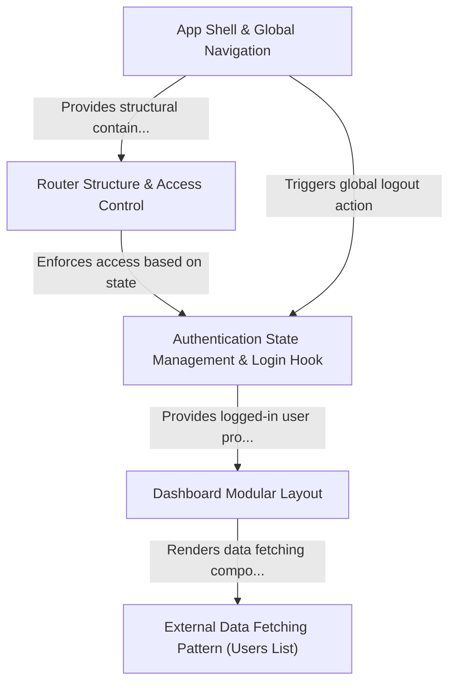

<table width="100%">
<tr>
<td align="left">

### [⬅ Readme](../readme.md)

</td>
<td align="right">

### [View on code2tutorial.com](https://code2tutorial.com/tutorial/334a50b4-4a5e-437a-9bad-caaa72ea7a8f/02_router_structure___access_control_.md)

</td>
</tr>
</table>

# Tutorial: dashboard &nbsp;&nbsp;<small><small>&nbsp;&nbsp;(&nbsp;Generated by [AI Codebase Knowledge Builder](https://github.com/The-Pocket/Tutorial-Codebase-Knowledge)&nbsp;)</small></small>

This project is a front-end **Web Dashboard** designed for *authenticated* access. It utilizes a specialized security system (Abstraction 0) to ensure only logged-in users can access protected routes like the profile and user lists. The application manages the entire login lifecycle using custom hooks and Redux (Abstraction 1), while the global structure (Abstraction 2) provides persistent navigation and universal logout functionality. Data-intensive sections, like the Users List, follow a clean *Redux/Hook pattern* (Abstraction 4) for fetching and displaying external information.

## Visual Overview

## Chapters

1. [App Shell & Global Navigation
](01_app_shell.md)
2. [Router Structure & Access Control
](02_router_structure.md)
3. [Authentication State Management & Login Hook
](03_authentication_state.md)
4. [Dashboard Modular Layout
](04_dashboard.md)
5. [External Data Fetching Pattern (Users List)
](05_external_data.md)

---